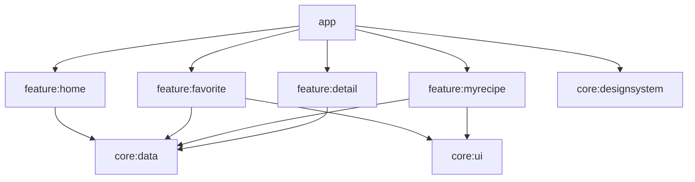
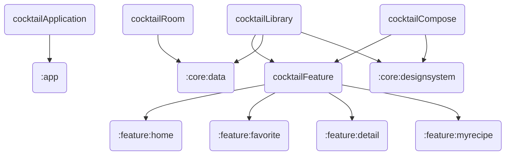

# CocktailRecipe

칵테일 레시피 api (www.thecocktaildb.com) 를 사용한 스터디용 앱

## Screens

* **[Home](https://github.com/PotatoMadness/CocktailRecipe/tree/master/feature/home)**
* **[Favorite](https://github.com/PotatoMadness/CocktailRecipe/tree/master/feature/favorite)**
* **[MyRecipe](https://github.com/PotatoMadness/CocktailRecipe/tree/master/feature/myrecipe)**
* **[Detail](https://github.com/PotatoMadness/CocktailRecipe/tree/master/feature/detail)**

### Language

- Kotlin

### Libraries

- AndroidX
  - Activity & Activity Compose
  - AppCompat
  - Core
  - Navigation

- Kotlin Libraries (Coroutine, Serialization)
- Compose
  - Material3
  - Navigation

- Firebase
  - Crashlytics
  - Realtime Database
    
- Dagger & Hilt
- Room
- Square (Retrofit, OkHttp)

### Project Structure

### Build Logic

